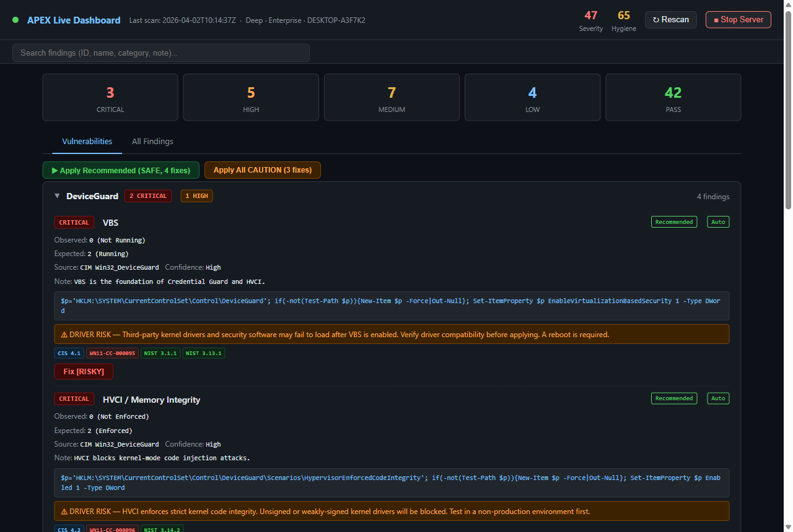
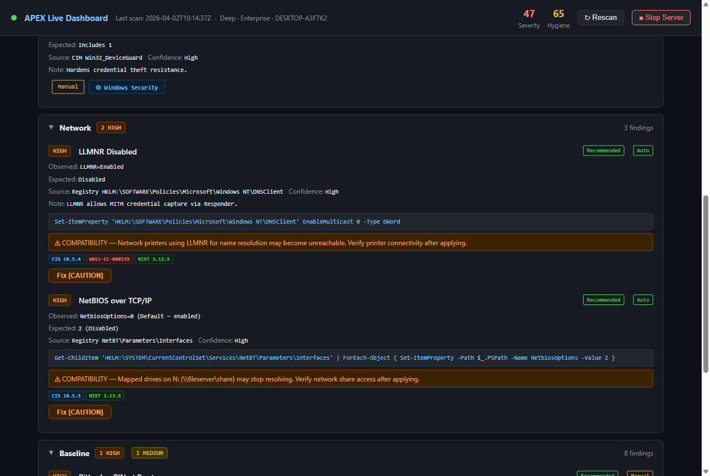
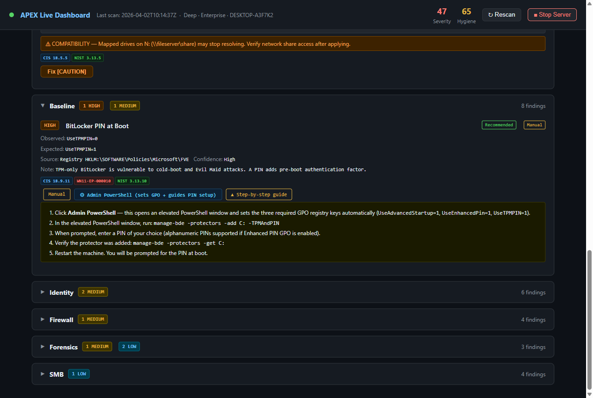

# APEX Zero-Trust Windows Auditor

> **Offline, standalone Windows security auditor and guided hardening tool — written in PowerShell. No internet connection, no cloud, no external agents.**

**v4.9.4** — 21 check domains · 60+ finding IDs · CIS / DISA STIG / NIST 800-171r2 compliance mapping · interactive remediation with backup and undo · browser-based WebUI · peripheral-aware compatibility warnings · step-by-step guided remediation

---

## Screenshots

| Dashboard | Finding detail | Step-by-step guide |
|-----------|---------------|-------------------|
|  |  |  |

---

## Features

- **Read-only by default** — collects configuration signals only; never changes anything without explicit `-Remediate` or WebUI fix action
- **Fully offline** — uses only OS-native channels (Registry, CIM/WMI, built-in cmdlets, `netsh`, `auditpol`, `wevtutil`)
- **Dual scoring** — SeverityScore (CRITICAL/HIGH exposure) and HygieneScore (MEDIUM/LOW hygiene), both 0–100
- **Delta engine** — baseline a known-good state, re-run after changes; the HTML report gains a Δ tab showing regressions, improvements, and new checks
- **Compliance mapping** — every finding annotated with CIS L1/L2, DISA STIG, and NIST 800-171r2 control IDs
- **Guided remediation** — interactive fix loop with safety tiers (SAFE / CAUTION / RISKY), automatic backup before every change, and full undo
- **Browser WebUI** (`-WebUI`) — live dashboard with per-finding fix buttons, guide steps, shortcut launchers, and real-time rescan
- **Peripheral-aware warnings** — detects printers, mapped drives, and shared folders; automatically annotates findings with compatibility impact before you apply fixes
- **Step-by-step guides** — manual findings show expandable guides with OS navigation steps and shortcut buttons to open the relevant Settings panel
- **Self-contained HTML report** — single file, no internet required, dark-themed with compliance badge rendering
- **Structured JSON output** — machine-readable, schema-stable, suitable for CI pipelines and SIEM ingestion

---

## Project structure

```
apex-auditor/
├── Windows_Audit.ps1              ← entry point (param block, manifest, main loop, wizard)
├── Engine/
│   ├── Core.ps1                   ← findings accumulator, helpers, scoring, delta, compliance
│   ├── Report.ps1                 ← TUI console report, HTML exporter, path resolver
│   ├── Remediate.ps1              ← backup, interactive fix loop, undo
│   ├── WebUI.ps1                  ← embedded HTTP server + single-page dashboard
│   ├── CompatScan.ps1             ← peripheral detection, _ImpactWarning, _Guide, _Shortcut stamping
│   └── Wizard.ps1                 ← post-scan guided wizard (profile-based recommendations)
├── Checks/
│   ├── Check-ASR.ps1              ← Attack Surface Reduction rules
│   ├── Check-AuditPol.ps1         ← Advanced audit subcategories (6 sub-checks)
│   ├── Check-Baseline.ps1         ← TPM, Secure Boot, BitLocker, Defender, Windows Update
│   ├── Check-CertStore.ps1        ← Root CA hygiene, expired personal certificates
│   ├── Check-DefenderExclusions.ps1  ← Dangerous exclusion extensions and paths
│   ├── Check-DeviceGuard.ps1      ← VBS, HVCI, WDAC/UMCI, Credential Guard
│   ├── Check-ExploitProtection.ps1   ← DEP, ASLR, CFG system-wide
│   ├── Check-Firewall.ps1         ← Per-profile firewall state, risky inbound rules
│   ├── Check-FirewallPosture.ps1  ← MpsSvc health, drop logging
│   ├── Check-Forensics.ps1        ← PS script-block logging, cmdline logging, Security log
│   ├── Check-Identity.ps1         ← WDigest, LSASS PPL, RID-500, LAPS, UAC
│   ├── Check-LocalAdmins.ps1      ← Local Administrators group membership
│   ├── Check-Network.ps1          ← LLMNR, NetBIOS, NTLM auth level
│   ├── Check-PrintSpooler.ps1     ← Print Spooler service + PointAndPrint + spool dir ACL
│   ├── Check-PS2Engine.ps1        ← PowerShell v2 engine availability
│   ├── Check-RDP.ps1              ← RDP enabled state, NLA enforcement
│   ├── Check-ScheduledTasks.ps1   ← Writable task executables, SYSTEM tasks, orphaned authors
│   ├── Check-ServicePaths.ps1     ← Unquoted service executable paths (Deep only)
│   ├── Check-SMB.ps1              ← SMBv1, signing server+client, encryption
│   ├── Check-Telemetry.ps1        ← Sysmon presence (informational)
│   └── Check-WEF.ps1              ← Windows Event Forwarding subscriptions (Deep only)
├── compliance_map.json            ← CIS / DISA STIG / NIST 800-171r2 control mapping
├── Invoke-AuditLabTest.ps1        ← Full scientific test harness (Suites S1–S9)
├── ExTest.ps1                     ← Convenience wrapper for the test harness
└── ROADMAP.md                     ← Future improvements and candidate checks
```

All layers must be present side-by-side. `Windows_Audit.ps1` dot-sources `Engine\Core.ps1`, `Engine\Report.ps1`, `Engine\Remediate.ps1`, `Engine\WebUI.ps1`, `Engine\CompatScan.ps1`, and `Engine\Wizard.ps1` outside the main `try/catch`, then dot-sources every `Checks\Check-*.ps1` via a glob. Missing files cause immediate `CommandNotFoundException`.

---

## Requirements

- Windows 10 / 11 (x64)
- PowerShell 5.1 (Windows PowerShell) or PowerShell 7+
- **Run as Administrator** — required for full WMI/CIM coverage, BitLocker status, SMB configuration, and audit policy reads
- All `Engine\` and `Checks\` files present in the directory structure above

---

## Quick start

```powershell
# From an elevated PowerShell prompt in the script directory:
Set-ExecutionPolicy -Scope Process Bypass -Force
.\Windows_Audit.ps1
```

Default: Deep mode, PersonalLaptop profile, auto-named JSON + HTML in the current directory.

---

## Usage

### Core audit

```powershell
.\Windows_Audit.ps1                                    # Deep scan, PersonalLaptop profile
.\Windows_Audit.ps1 -Mode Fast -Profile Enterprise     # Fast scan, Enterprise profile
.\Windows_Audit.ps1 -Mode Deep -SkipHTML               # JSON only — CI-friendly
.\Windows_Audit.ps1 -Mode Deep -ExportJSON "C:\Audits\audit.json"
```

**Modes:**

| Mode | Checks | Notes |
|------|--------|-------|
| `Fast` | 18 | All checks except `Check-WEF`, `Check-ServicePaths`, and `Check-ScheduledTasks` (deep analysis only) |
| `Deep` | 21 | Full posture — all checks including WEF subscription enumeration, unquoted service path analysis, and scheduled task ACL inspection |

**Profiles** — stored in the JSON context field:

| Profile | Intended threat model |
|---------|----------------------|
| `PersonalLaptop` | Personal device, consumer posture (default) |
| `Enterprise` | Domain-joined workstation, corporate baseline |
| `Lab` | Test/dev environment |
| `Paranoid` | High-value targets, strictest interpretation |

### Browser WebUI

```powershell
.\Windows_Audit.ps1 -WebUI                             # Scan + open live dashboard
.\Windows_Audit.ps1 -WebUI -Port 8080                  # Custom port (default: 8443)
```

Opens a local HTTP dashboard at `http://localhost:<port>` with:
- Live findings list grouped by category, sorted by severity
- Per-finding **Fix** buttons with SAFE / CAUTION / RISKY tier confirmation
- CAUTION and RISKY modals display the finding's specific compatibility warning
- **Step-by-step guide** toggle on Manual findings (stays open across poll cycles)
- **Shortcut buttons** to open the relevant Windows Settings panel directly
- **Apply Recommended** batch button for all SAFE-tier fixes
- **Rescan** to re-run the audit after applying fixes
- Peripheral detection banner (printers, shared folders) when compatibility warnings are active
- Two-second polling with automatic backoff if the server stops

### Baseline and delta tracking

```powershell
# Capture baseline at a known-good state
.\Windows_Audit.ps1 -Baseline "C:\Baselines\before_patch.json"

# Compare after changes (patches, config drift, new software)
.\Windows_Audit.ps1 -CompareTo "C:\Baselines\before_patch.json" -ExportJSON "C:\Audits\after.json"
```

The HTML report gains a **Δ Delta** tab showing regressions, improvements, and new checks side-by-side.

### Remediation mode

```powershell
# Interactive fix loop after the audit report
.\Windows_Audit.ps1 -Remediate
```

For each vulnerable finding the tool displays the finding, its safety tier, any compatibility warning, and the exact fix command, then prompts:

```
[Y]es  [N]o  [A]ll-safe  [S]kip-remaining  [Q]uit
```

**Safety tiers:**

| Tier | Behaviour | Examples |
|------|-----------|---------|
| `SAFE` | Can be batch-applied with `[A]` | WDigest disable, PS logging keys, SMB signing flags |
| `CAUTION` | Requires per-item confirmation | LLMNR/NetBIOS, SMB encryption, Spooler service |
| `RISKY` | Requires typing `YES` explicitly — never batch-applied | BitLocker, PPL, VBS, UAC, SMB1 removal |

Before every applied fix, the tool exports the affected registry hive (`.reg`) or service state (`.json`) to `C:\ProgramData\ApexAudit\Backups\<timestamp>\`.

### Undo

```powershell
# Restore all registry exports and service states from a previous remediation run
.\Windows_Audit.ps1 -Undo "C:\ProgramData\ApexAudit\Backups\20260330_120000"
```

### Other options

```powershell
.\Windows_Audit.ps1 -ShowSignals   # Append raw ASR rule GUIDs + actions to JSON
.\Windows_Audit.ps1 -NoTUI         # Suppress console output
.\Windows_Audit.ps1 -Help          # Full help
.\Windows_Audit.ps1 -Version       # Version string
```

---

## Peripheral-aware compatibility warnings

Before stamping findings, `Engine\CompatScan.ps1` enumerates:
- **Printers** — network, shared, and local physical printers (via `Win32_Printer`)
- **Mapped network drives** — UNC-backed drives (via `Get-PSDrive`)
- **Shared folders** — non-default SMB shares (via `Get-SmbShare`)

Findings that could break detected peripherals or services are automatically annotated with `_ImpactWarning`. These are shown as orange banners on finding cards in the WebUI, printed in yellow `[!]` lines before fix prompts in the console, and included verbatim in CAUTION/RISKY confirmation modals.

**Findings with compatibility warnings:**

| Finding | Warning type | Condition |
|---------|-------------|-----------|
| `SPOOLER-SVC` | PRINTER IMPACT | Physical printers detected |
| `SPOOLER-PNP` | PRINTER IMPACT | Physical printers detected |
| `SMB1` | COMPATIBILITY | Network printers or mapped drives |
| `SMBENC` | COMPATIBILITY | Shared printers, shared folders, or network printers |
| `SMBSIGS` / `SMBSIGC` | COMPATIBILITY | Mapped drives or shared folders |
| `NTLM` | COMPATIBILITY | Network printers or mapped drives |
| `LLMNR` | COMPATIBILITY | Network printers, mapped drives, or shared printers |
| `NETBIOS` | COMPATIBILITY | Network printers or mapped drives |
| `FW-Domain/Private/Public` | COMPATIBILITY | Shared printers or shared folders |
| `FW-SVC` | CONNECTIVITY | Unconditional |
| `VBS` / `HVCI` | DRIVER RISK | Unconditional |
| `CG` | COMPATIBILITY | Unconditional |
| `RDP` | SESSION RISK | Unconditional |
| `RDP-NLA` | SESSION RISK | Unconditional |
| `PPL` | DRIVER RISK | Unconditional |
| `CFA` | APPLICATION RISK | Unconditional |
| `ASR` | APPLICATION RISK | Unconditional |
| `EXPROT-DEP` | APPLICATION RISK | Unconditional |
| `EXPROT-ASLR` | APPLICATION RISK | Unconditional |
| `UNQUOTED_SERVICE_PATH` | SERVICE RISK | Unconditional |

---

## Check domains

| Category | Check file | Finding IDs | Mode |
|----------|-----------|-------------|------|
| Baseline | Check-Baseline.ps1 | TPM, SBOOT, BLENC, BLPBA, RTP, PUA, CFA, WU | Fast+Deep |
| DeviceGuard | Check-DeviceGuard.ps1 | VBS, HVCI, UMCI, CG | Fast+Deep |
| Firewall | Check-Firewall.ps1 | FW-Domain, FW-Private, FW-Public, FWRISK | Fast+Deep |
| FirewallPosture | Check-FirewallPosture.ps1 | FW-SVC, FW-LOG | Fast+Deep |
| SMB | Check-SMB.ps1 | SMB1, SMBSIGS, SMBSIGC, SMBENC | Fast+Deep |
| RDP | Check-RDP.ps1 | RDP, RDP-NLA | Fast+Deep |
| Network | Check-Network.ps1 | LLMNR, NETBIOS, NTLM | Fast+Deep |
| Identity | Check-Identity.ps1 | WDIG, PPL, SID500, LAPS, UAC, UAC-SD | Fast+Deep |
| LocalAdmins | Check-LocalAdmins.ps1 | LOCALADMIN | Fast+Deep |
| Defender | Check-DefenderExclusions.ps1 | DEFEXCL-EXT, DEFEXCL-PATH, DEFEXCL-COUNT | Fast+Deep |
| ExploitProt | Check-ExploitProtection.ps1 | EXPROT-DEP, EXPROT-ASLR, EXPROT-CFG | Fast+Deep |
| Forensics | Check-Forensics.ps1 | PSLOG, CMDLINE, SECLOG | Fast+Deep |
| Telemetry | Check-Telemetry.ps1 | SYSMON | Fast+Deep |
| ASR | Check-ASR.ps1 | ASR | Fast+Deep |
| AuditPolicy | Check-AuditPol.ps1 | AUDITPOL_PROCESS_CREATION, _CREDENTIAL_VALID, _LOGON, _LOCKOUT, _SPECIAL_LOGON, _GROUP_MGMT | Fast+Deep |
| PrintSpooler | Check-PrintSpooler.ps1 | SPOOLER-SVC, SPOOLER-PNP, SPOOLER-DIR | Fast+Deep |
| PS2Engine | Check-PS2Engine.ps1 | PS2ENGINE | Fast+Deep |
| CertStore | Check-CertStore.ps1 | CERT-NONMS, CERT-EXPIRED | Fast+Deep |
| EventFwd | Check-WEF.ps1 | WEF | **Deep only** |
| Services | Check-ServicePaths.ps1 | UNQUOTED_SERVICE_PATH:\<svcname\> | **Deep only** |
| SchedTasks | Check-ScheduledTasks.ps1 | SCHTASK-WRITABLE, SCHTASK-SYSTEM, SCHTASK-NOAUTHOR | **Deep only** |

---

## JSON output schema (v4.9)

```json
{
  "context": {
    "Hostname":     "string",
    "OSCaption":    "string",
    "OSBuild":      "string",
    "DomainJoined": "bool",
    "IsPortable":   "bool",
    "TimestampUTC": "yyyy-MM-ddTHH:mm:ssZ",
    "Mode":         "Fast|Deep",
    "Profile":      "PersonalLaptop|Enterprise|Lab|Paranoid",
    "PSVersion":    "string",
    "ToolVersion":  "string"
  },
  "scores": {
    "SeverityScore": "int (0–100)",
    "HygieneScore":  "int (0–100)"
  },
  "peripherals": {
    "Printers":      [{ "Name": "string", "Type": "Network|Shared|Local" }],
    "SharedFolders": ["string"],
    "MappedDrives":  ["string"]
  },
  "findings": [
    {
      "Id":             "string — unique per run",
      "Category":       "string",
      "CheckName":      "string",
      "Severity":       "CRITICAL | HIGH | MEDIUM | LOW | PASS",
      "Vulnerable":     "bool",
      "Confidence":     "High | Medium | Low | NotApplicable | NoAccess | QueryFailed",
      "Observed":       "string",
      "Expected":       "string",
      "Source":         "string",
      "Fix":            "string",
      "Note":           "string",
      "Recommendation": "Recommended | Optional | Informational (null if absent)",
      "ComplianceRefs": {
        "CIS":       ["string"],
        "CIS_Level": "int",
        "STIG":      ["string"],
        "NIST":      ["string"]
      },
      "_Tier":          "SAFE | CAUTION | RISKY",
      "_FixType":       "Auto | Manual | None",
      "_ImpactWarning": "string (present only when a compatibility risk exists)",
      "_Guide":         ["string"] "(present only on Manual findings with step-by-step instructions)",
      "_Shortcut":      { "Cmd": "string", "Label": "string" } "(present only when a Settings shortcut exists)"
    }
  ]
}
```

**Scoring:**
```
SeverityScore = 100 − Σ(CRITICAL×15 + HIGH×8)   [floor 0]
HygieneScore  = 100 − Σ(MEDIUM×5   + LOW×2)     [floor 0]
```

**Exit codes:** `0` = no vulnerabilities · `1` = vulnerabilities found · `2` = fatal error

**Schema invariants:**
- `Vulnerable=true` never co-exists with `Severity=PASS`
- `Confidence=NoAccess` never has `Vulnerable=true`
- Every `Vulnerable=true` finding has a non-`N/A` Fix field
- All finding IDs are unique within a single run
- `_` prefixed fields are runtime annotations — not present in the baseline JSON written by `-Baseline`
- `ComplianceRefs` present on all findings when `compliance_map.json` is found

---

## Running the test suite

```powershell
.\ExTest.ps1 -AuditScript .\Windows_Audit.ps1                         # All suites
.\ExTest.ps1 -AuditScript .\Windows_Audit.ps1 -ExportJUnit            # + JUnit XML for CI
.\Invoke-AuditLabTest.ps1 -AuditScript .\Windows_Audit.ps1 -Suites S1,S2,S9
.\Invoke-AuditLabTest.ps1 -AuditScript .\Windows_Audit.ps1 -SkipMatrix  # Faster on slow machines
```

| Suite | Validates |
|-------|-----------|
| S1 | Static analysis: AST parse, UTF-8 no BOM, PSScriptAnalyzer, typed params, help block, 21 check functions present |
| S2 | JSON schema: top-level fields, Context values, score ranges, Findings array, Severity/Confidence enums, unique IDs, schema invariants, Fix coverage |
| S3 | Smoke matrix: 5 mode×profile combinations — exit code + JSON + HTML produced |
| S4 | Exit code contract: 0 when clean, 1 when findings exist |
| S5 | Idempotency: two consecutive Deep runs produce identical JSON |
| S6 | Performance: Fast and Deep complete within bounds; Fast ≤ Deep elapsed |
| S7 | Boundary cases: `-Help`, `-Version`, invalid Mode/Profile, unwritable path, `-SkipHTML`, `-CompareTo` missing file |
| S8 | Delta engine: baseline write, compare, Delta object structure, score polarity |
| S9 | Check coverage: verifies all expected finding IDs present in Deep output |

---

## Adding a new check

1. Create `Checks\Check-<Domain>.ps1` with a single exported function `Invoke-Check<Domain>`.
2. Add an entry to `$Script:CheckManifest` in `Windows_Audit.ps1`: `Fn`, `Modes` array, `NeedsAdmin`, `Phase`.
3. Every signal must call `Add-Finding` with all mandatory fields. Use `Fix = 'N/A'` only when a control is genuinely non-remediable.
4. Wrap every external query in its own `try/catch` returning `Confidence='QueryFailed'` — never let exceptions propagate.
5. If multiple findings share a single `try` block, use the rollback pattern (`$countBefore = $Script:Findings.Count`) to prevent partial finding sets on failure.
6. Add the new finding IDs to `compliance_map.json`.
7. Add the IDs to S9's expected-ID list in `Invoke-AuditLabTest.ps1`.
8. To add a compatibility warning, add a `switch -Regex` branch in `Set-FindingImpactFlags` in `Engine\CompatScan.ps1`.
9. To add a step-by-step guide or shortcut, add an entry in `Set-FindingGuides` in `Engine\CompatScan.ps1`.
10. Run `.\ExTest.ps1 -AuditScript .\Windows_Audit.ps1 -Suites S1,S2,S9` before opening a PR.

---

## License

MIT — see `LICENSE`.
